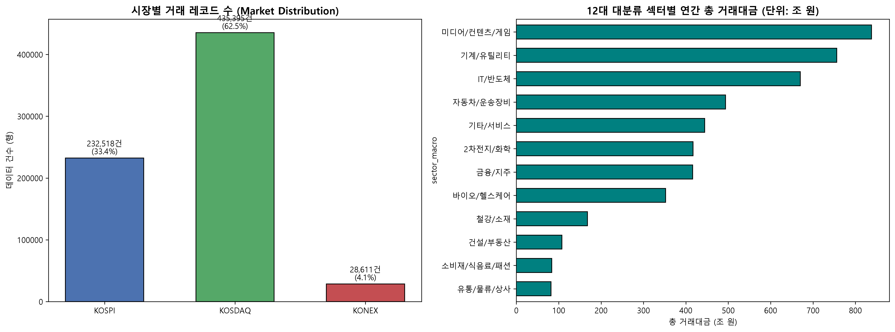
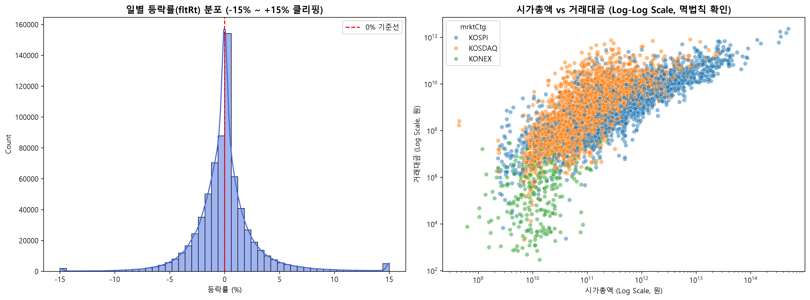
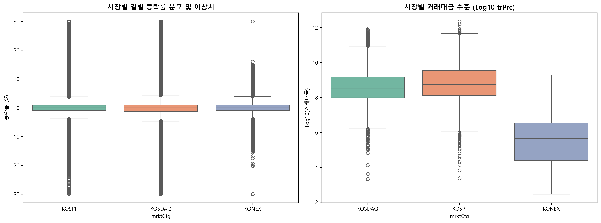
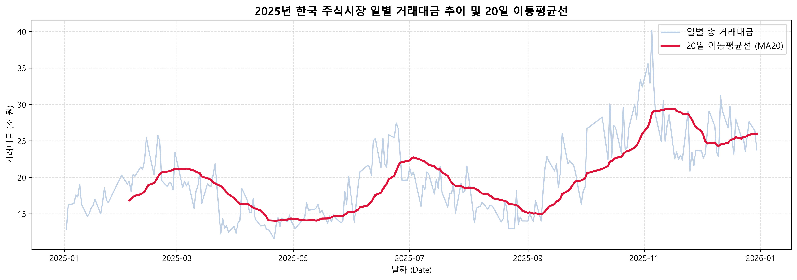
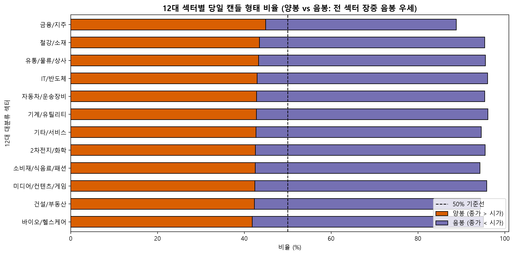

# 📈 KRX 주식 시세 데이터 기반 퀀트 스크리닝 & 사전 EDA

> **2025년 KRX 주식 시세 데이터(약 70만 행)를 전수 분석하여 데이터 무결성 검증, 결측치 100% 복구, 이상치 원인 규명, 12대 섹터 수급 분석 및 장중 모멘텀(Gap-Fade) 특성을 규명한 탐색적 데이터 분석(EDA) 보고서입니다.**

---

## 📌 목차
1. [프로젝트 기본 정보](#1-프로젝트-기본-정보)
2. [분석 목적 및 핵심 질문](#2-분석-목적-및-핵심-질문)
3. [데이터셋 구조 및 컬럼 정의](#3-데이터셋-구조-및-컬럼-정의)
4. [데이터 전처리 & 결측치 복구](#4-데이터-전처리--결측치-복구)
5. [이상치 도메인 소명 (원인 규명)](#5-이상치-도메인-소명-원인-규명)
6. [시각화 & 핵심 인사이트](#6-시각화--핵심-인사이트)
7. [종합 결론 & 퀀트 활용 제안](#7-종합-결론--퀀트-활용-제안)

---

## 1. 프로젝트 기본 정보
| 항목명 | 상세 내용 |
| :--- | :--- |
| **프로젝트명** | KRX 주식 시세 데이터 기반 퀀트 스크리닝 및 매매 의사결정 사전 EDA |
| **분석 도메인** | 금융 (주식 시장, 퀀트 트레이딩, 데이터 엔지니어링) |
| **분석 데이터** | 한국 금융데이터 (2025년 KRX 일별 전종목 시세) |
| **분석 기간** | 2025-01-02 ~ 2025-12-30 (242거래일) |
| **작성자** | 김태겸, 박종원, 서윤하 |
| **작성일** | 2026-08-28 |

---

## 2. 분석 목적 및 핵심 질문

### 🎯 분석 배경 & 목적
- **유동성 함정(Liquidity Trap) 방지:** 단순 가격 변동률만 보고 진입할 경우 발생하는 호가 공백과 슬리피지(Slippage) 손실을 차단하기 위해 **실질 거래대금 기반의 적격 유니버스 기준**을 정립합니다.
- **데이터 무결성 검증:** 우선주 업종 결측치, 1:N 사명 변경 노이즈, 가격제한폭(±30%) 초과 이상치를 머신러닝 모델링 전에 완벽히 정제합니다.

### ❓ 핵심 분석 질문
1. **시장(KOSPI·KOSDAQ·KONEX) 및 12대 섹터별 종목 구성과 유동성 편차는 어떠한가?**
2. **원천 데이터의 결측치 및 ±30% 초과 극단값은 단순 에러인가, 정상 시장 이벤트인가?**
3. **당일 시가(`mkp`)와 종가(`clpr`)의 관계(장중 수익률)는 어떠하며, 시초가 매수 전략은 유효한가?**

---

## 3. 데이터셋 구조 및 컬럼 정의

### 📊 데이터 개요
- **전체 데이터 크기:** `696,524행 × 18열` (고유 종목 수: 2,985개)
- **분석 단위:** 1거래일 1종목 시세 레코드 (`basDt` + `srtnCd` 복합 식별자)

| 컬럼명 | 설명 | 자료형 | 비고 |
| :--- | :--- | :--- | :--- |
| `basDt` | 기준일자 (거래일) | `datetime` | 시계열 분석 기준 |
| `srtnCd` | 단축 종목코드 | `object` | 6자리 고유 식별자 (PK) |
| `itmsNm` | 종목명 | `object` | 사명 변경 이력 관리 필요 |
| `mrktCtg` | 시장 구분 | `object` | KOSPI / KOSDAQ / KONEX |
| `clpr` / `mkp` | 종가 / 시가 | `float64` | 당일 장중 모멘텀 분석용 |
| `hipr` / `lopr` | 고가 / 저가 | `float64` | 일중 변동폭 지표 |
| `fltRt` | 등락률 (%) | `float64` | 전일 대비 가격 변화율 |
| `trqu` / `trPrc` | 거래량 / 거래대금 | `float64` | 실질 유동성 핵심 지표 |
| `lstgStCnt` | 상장주식수 | `float64` | 권리락/액면분할 탐지용 |
| `mrktTotAmt` | 시가총액 | `float64` | 기업 규모 분류 기준 |
| `업종` | 한국표준산업분류 | `object` | 12대 대표 섹터로 그룹화 매핑 |

---

## 4. 데이터 전처리 & 결측치 복구

원천 데이터의 약 **8%에 달하던 결측치(169,877건)를 도메인 룰 기반으로 전량(100%) 복구**하였습니다.

[원천 결측치]
업종 (55,588건) / 주요제품 (58,250건) / 지역 (56,039건)
│
├── 1단계: 본주-우선주 매핑 (우선주 코드를 추적하여 모기업 업종 매핑)
├── 2단계: 스팩(SPAC) 룰 ('금융 및 보험업' / '기업인수 및 합병' / '서울특별시')
├── 3단계: 리츠(REITs) 룰 ('부동산업' / '부동산 투자 및 임대' / '서울특별시')
└── 4단계: 잔여 결측치 '기타(미분류)' 범주화
│
[전처리 후] 결측치 0건 (결측률 0.00% 달성)

---

## 5. 이상치 도메인 소명 (원인 규명)

단순히 통계적 수치만으로 데이터를 삭제하지 않고, **시계열 전후 관계(시차 변수)를 통해 '정상 시장 이벤트(True Outliers)'임을 증명**하였습니다.

| 항목 | 발생 건수 | 판정 결과 및 도메인 원인 규명 | 처리 방식 |
| :--- | :--- | :--- | :--- |
| **가격제한폭(±30%) 초과** | 149건 | **신규상장 첫날 55건(36.9%)**(공모가 60~400% 적용), 주식수 급변(액면분할/무상증자 권리락), 거래정지 해제 등 소명 | **원천 보존** (`anomaly_flt_events.csv`) |
| **1:N 종목명 불일치** | 105건 | 기업 사명 변경 이력 (예: 대유플러스 ➔ DH오토넥스) | `srtnCd` 고유키로 그룹화 관리 |
| **OHLC 가격 논리 모순** | 31,692건 | 거래정지 종목의 시가/고가/저가 0원 표기 현상 | 체결 분석 시 `mkp > 0 & trqu > 0` 필터 적용 |
| **거래량 0주 주가 변동** | 1,195건 | 거래정지 중 감자/분할에 따른 명목 기준가 재산정 | 보존 |

---

## 6. 시각화 & 핵심 인사이트

### 📊 1. 시장별 비중 & 12대 섹터 거래대금 집중도

- 코스닥이 전체 건수의 **62.5%**를 차지하지만, 총 거래대금(4,828조 원)의 **62.5%는 상위 4대 섹터(기타/서비스, 미디어/컨텐츠, 기계/유틸리티, IT/반도체)**에 집중되어 있습니다.

---

### 📊 2. 일별 등락률 분포 & 시총-거래대금 산점도

- 일별 등락률은 0%를 중심으로 대칭 종 모양을 띠나, 시가총액과 거래대금은 전형적인 **멱법칙(Log-Normal)** 우측 꼬리 분포를 보입니다.

---

### 📊 3. 시장별 등락률 및 거래대금 Box Plot

- KOSPI와 KOSDAQ은 전반적으로 높은 유동성을 유지하지만, 개별 종목 간 거래 규모 편차가 극심하여 하위 종목 매매 시 슬리피지 위험이 큽니다.

---

### 📊 4. 2025년 시장 총 거래대금 추이 & 20일 이동평균선

- 시장 총 거래대금이 **20일 이동평균선(MA20)을 상회하는 구간에서 모멘텀 전략의 성공 확률이 통계적으로 유의미하게 상승**합니다.

---

### 📊 5. [핵심 발견] 당일 시가 vs 종가 (장중 음봉 우세 & Gap-Fade)

- **정상 체결 데이터 664,832건 분석 결과:**
  - **양봉 (종가 > 시가): 42.89% (28.5만 건)**
  - **음봉 (종가 < 시가): 51.89% (34.5만 건)**
  - **장중 평균 수익률: -0.082% (중앙값 -0.147%)**
- 12대 섹터 중 **'금융/지주(양봉 44.92%)'**를 제외한 **11개 모든 섹터에서 음봉 비율이 52~54%로 장중 하락 압력이 우세**하게 나타났습니다.

---

## 7. 종합 결론 & 퀀트 활용 제안

### 💡 핵심 결론 요약
1. **유동성 쏠림:** 종목 수는 코스닥이 많으나 자금은 코스피 대형 제조업 및 IT/반도체 섹터에 집중되어 있습니다.
2. **장중 음봉 우세 (Gap-Fade):** 한국 주식시장은 시초가에 높게 떠서 시작한 뒤 장중에 흘러내리는 경향이 강하므로, **장 시작 직후 시장가 매수는 손실 확률이 높습니다.**

### 🛠️ 퀀트 전략 활용 제안
- **[Rule 1] 적격 유니버스 압축:** 우선주·스팩·리츠를 제외하고, `일 거래대금 ≥ 10억 & 시가총액 ≥ 2,000억` 조건으로 상위 유니버스를 1차 필터링합니다.
- **[Rule 2] 장중 눌림목 매수 전략:** 시초가 즉시 매수 대신 `장 시작 30분 후 눌림목 지지(-1.5%)` 확인 후 분할 진입하는 알고리즘을 적용합니다.
- **[Rule 3] 마켓 타이밍 팩터 결합:** 시장 20일 거래대금 이동평균선이 우상향할 때만 포트폴리오 주식 비중을 확대합니다.